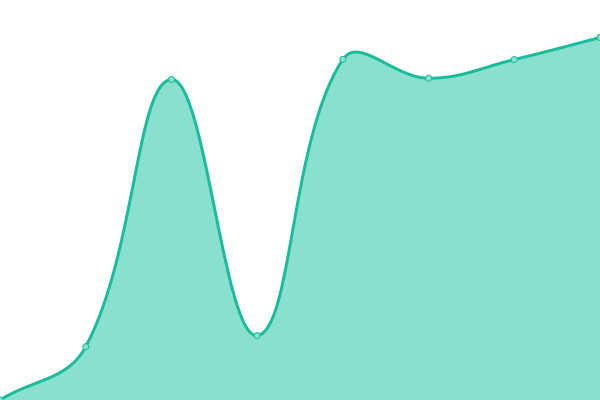

# [📈 Live Status](https://status.fovir.fyi): <!--live status--> **🟧 Partial outage**

This repository contains the open-source uptime monitor and status page for [Fovir](https://www.fovir.fyi), powered by [Upptime](https://github.com/upptime/upptime).

<!--start: status pages-->
<!-- This summary is generated by Upptime (https://github.com/upptime/upptime) -->
<!-- Do not edit this manually, your changes will be overwritten -->
<!-- prettier-ignore -->
| URL | Status | History | Response Time | Uptime |
| --- | ------ | ------- | ------------- | ------ |
|  [Home Page](https://www.fovir.fyi/) | 🟩 Up | [home-page.yml](https://github.com/Fovir-GitHub/status/commits/HEAD/history/home-page.yml) | 

 436ms
     
 | 

<a href="https://status.fovir.fyi/history/home-page">100.00%</a>
    

|  [Authelia](https://auth.fovir.fyi/) | 🟩 Up | [authelia.yml](https://github.com/Fovir-GitHub/status/commits/HEAD/history/authelia.yml) | 

 3049ms
     
 | 

<a href="https://status.fovir.fyi/history/authelia">59.86%</a>
    

|  [Flapalerted](https://flapalerted.fovir.fyi/) | 🟩 Up | [flapalerted.yml](https://github.com/Fovir-GitHub/status/commits/HEAD/history/flapalerted.yml) | 

 2850ms
     
 | 

<a href="https://status.fovir.fyi/history/flapalerted">59.87%</a>
    

|  [Wakapi](https://wakapi.fovir.fyi/) | 🟩 Up | [wakapi.yml](https://github.com/Fovir-GitHub/status/commits/HEAD/history/wakapi.yml) | 

 3141ms
     
 | 

<a href="https://status.fovir.fyi/history/wakapi">59.88%</a>
    

|  [Music](https://music.fovir.fyi/) | 🟩 Up | [music.yml](https://github.com/Fovir-GitHub/status/commits/HEAD/history/music.yml) | 

 2876ms
     
 | 

<a href="https://status.fovir.fyi/history/music">59.90%</a>
    

|  [OpenList](https://list.fovir.fyi/) | 🟩 Up | [open-list.yml](https://github.com/Fovir-GitHub/status/commits/HEAD/history/open-list.yml) | 

 2975ms
     
 | 

<a href="https://status.fovir.fyi/history/open-list">59.91%</a>
    

|  [RSS](https://rss.fovir.fyi/) | 🟩 Up | [rss.yml](https://github.com/Fovir-GitHub/status/commits/HEAD/history/rss.yml) | 

 2860ms
     
 | 

<a href="https://status.fovir.fyi/history/rss">59.92%</a>
    

|  [GoToSocial](https://social.fovir.fyi/) | 🟥 Down | [go-to-social.yml](https://github.com/Fovir-GitHub/status/commits/HEAD/history/go-to-social.yml) | 

 2362ms
     
 | 

<a href="https://status.fovir.fyi/history/go-to-social">58.28%</a>
    

|  [Gotify](https://gotify.fovir.fyi/) | 🟩 Up | [gotify.yml](https://github.com/Fovir-GitHub/status/commits/HEAD/history/gotify.yml) | 

 2903ms
     
 | 

<a href="https://status.fovir.fyi/history/gotify">59.95%</a>
    

|  [Karakeep](https://karakeep.fovir.fyi/) | 🟥 Down | [karakeep.yml](https://github.com/Fovir-GitHub/status/commits/HEAD/history/karakeep.yml) | 

 2917ms
     
 | 

<a href="https://status.fovir.fyi/history/karakeep">57.39%</a>
    

|  [LG](https://lg.fovir.fyi/) | 🟩 Up | [lg.yml](https://github.com/Fovir-GitHub/status/commits/HEAD/history/lg.yml) | 

 3088ms
     
 | 

<a href="https://status.fovir.fyi/history/lg">59.97%</a>
    

|  [Search](https://search.fovir.fyi/) | 🟩 Up | [search.yml](https://github.com/Fovir-GitHub/status/commits/HEAD/history/search.yml) | 

 2965ms
     
 | 

<a href="https://status.fovir.fyi/history/search">59.99%</a>
    

<!--end: status pages-->

[**Visit my status website →**](https://status.fovir.fyi)

## 📄 License

- Powered by: [Upptime](https://github.com/upptime/upptime)
- Code: [MIT](./LICENSE) © [Anand Chowdhary](https://anandchowdhary.com), supported by [Pabio](https://pabio.com)
- Data in the `./history` directory: [Open Database License](https://opendatacommons.org/licenses/odbl/1-0/)
