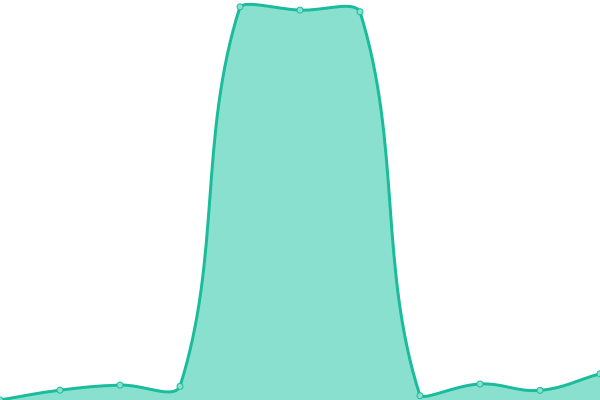
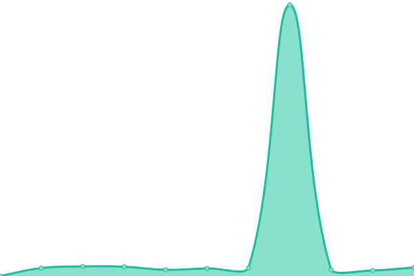
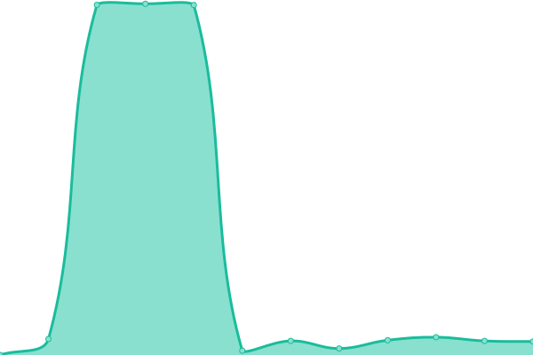

# [📈 Live Status](https://status.fovir.fyi): <!--live status--> **🟩 All systems operational**

This repository contains the open-source uptime monitor and status page for [Fovir](https://www.fovir.fyi), powered by [Upptime](https://github.com/upptime/upptime).

<!--start: status pages-->
<!-- This summary is generated by Upptime (https://github.com/upptime/upptime) -->
<!-- Do not edit this manually, your changes will be overwritten -->
<!-- prettier-ignore -->
| URL | Status | History | Response Time | Uptime |
| --- | ------ | ------- | ------------- | ------ |
|  [Home Page](https://www.fovir.fyi/) | 🟩 Up | [home-page.yml](https://github.com/Fovir-GitHub/status/commits/HEAD/history/home-page.yml) | 

 305ms
     
 | 

<a href="https://status.fovir.fyi/history/home-page">100.00%</a>
    

|  [Wakapi](https://wakapi.fovir.fyi/) | 🟩 Up | [wakapi.yml](https://github.com/Fovir-GitHub/status/commits/HEAD/history/wakapi.yml) | 

 2785ms
     
 | 

<a href="https://status.fovir.fyi/history/wakapi">99.57%</a>
    

|  [Music](https://music.fovir.fyi/) | 🟩 Up | [music.yml](https://github.com/Fovir-GitHub/status/commits/HEAD/history/music.yml) | 

 2727ms
     
 | 

<a href="https://status.fovir.fyi/history/music">99.06%</a>
    

|  [Book](https://book.fovir.fyi/) | 🟩 Up | [book.yml](https://github.com/Fovir-GitHub/status/commits/HEAD/history/book.yml) | 

 2706ms
     
 | 

<a href="https://status.fovir.fyi/history/book">99.57%</a>
    

|  [OpenList](https://list.fovir.fyi/) | 🟩 Up | [open-list.yml](https://github.com/Fovir-GitHub/status/commits/HEAD/history/open-list.yml) | 

 2766ms
     
 | 

<a href="https://status.fovir.fyi/history/open-list">99.58%</a>
    

|  [RSS](https://rss.fovir.fyi/) | 🟩 Up | [rss.yml](https://github.com/Fovir-GitHub/status/commits/HEAD/history/rss.yml) | 

 2686ms
     
 | 

<a href="https://status.fovir.fyi/history/rss">99.09%</a>
    

|  [GoToSocial](https://social.fovir.fyi/) | 🟩 Up | [go-to-social.yml](https://github.com/Fovir-GitHub/status/commits/HEAD/history/go-to-social.yml) | 

 2686ms
     
 | 

<a href="https://status.fovir.fyi/history/go-to-social">99.52%</a>
    

<!--end: status pages-->

[**Visit my status website →**](https://status.fovir.fyi)

## 📄 License

- Powered by: [Upptime](https://github.com/upptime/upptime)
- Code: [MIT](./LICENSE) © [Anand Chowdhary](https://anandchowdhary.com), supported by [Pabio](https://pabio.com)
- Data in the `./history` directory: [Open Database License](https://opendatacommons.org/licenses/odbl/1-0/)
